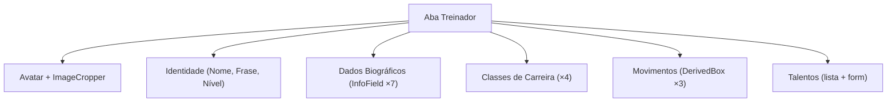
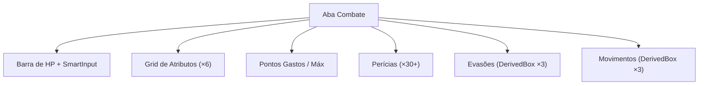

# 🏠 App

> Componente raiz do [[Trainer Card Pro]].
> Arquivo: `App.tsx` — **~780 linhas**

---

## Visão Geral

O `App` é o **componente-mãe** que orquestra todo o estado, sincronização assíncrona com a API e navegação da ficha. Ele renderiza:
1. **Header** com tema seletor e contadores do personagem.
2. **Abas fixas** de navegação (6 abas da Pokédex) + **Abas dinâmicas** de fichas de Pokémon.
3. **Conteúdo** condicional por aba ativa (incluindo fichas de Pokémon renderizadas inline).
4. **Footer** temático do SO da Pokédex.
5. **Modais** flutuantes (tooltip de talentos, [[ImageCropper]] e Trocas).

---

## Design e Layout visual (Pokédex Full-Screen)

Visando maximizar o aproveitamento de tela e proporcionar uma experiência premium e imersiva para o jogador, a estrutura visual da Pokédex foi totalmente remodelada:
- **Tamanho da Tela**: Ocupa 100% de largura e altura da viewport (`w-full h-full`).
- **Margens Internas (Padding)**: Possui um espaçamento uniforme de `20px` (`p-[20px]`) em todas as direções (superior, inferior, esquerda e direita), fazendo com que a Pokédex flutue elegantemente na página.
- **Bordas**: Mantém as icônicas bordas ultra arredondadas (`rounded-[2.5rem]`) para preservar a estética de console de bolso futurista.

---

## Estado (State)

| Variável | Tipo | Descrição |
|---|---|---|
| `trainer` | [[Types#TrainerData]] | Estado completo da ficha vindo da API SQLite |
| `activeTab` | `string` | Aba ativa — aceita IDs fixos (`'treinador'`, `'combate'`, etc.) e dinâmicos (`'pokemon-team-<id>'`, `'pokemon-pc-<box>-<slot>'`) |
| `pokemonTabs` | `PokemonTab[]` | Array de metadados das abas dinâmicas de Pokémon abertas |
| `currentTheme` | [[Constants#PokedexTheme]] | Tema de cores atual |
| `newItemName` | `string` | Nome do novo item (inventário) |
| `newItemDesc` | `string` | Descrição do novo item |
| `newItemQty` | `number` | Quantidade do novo item |
| `newTalent` | `string` | Nome do novo talento |
| `newTalentDesc` | `string` | Descrição do novo talento |
| `hoveredTalent` | `{ content, x, y } \| null` | Tooltip de talento |
| `showOnlyTrained` | `boolean` | Filtro de perícias treinadas |
| `imageToCrop` | `string \| null` | Imagem base64 para recorte |

### Interface PokemonTab

```typescript
interface PokemonTab {
  id: string;          // 'pokemon-team-<id>' ou 'pokemon-pc-<boxIndex>-<slot>'
  label: string;       // Nome exibido na aba
  type: 'ephemeral' | 'persistent';
  origin: 'pc' | 'team';
  pokemonId?: string;  // Se origin === 'team'
  boxIndex?: number;   // Se origin === 'pc'
  slot?: number;       // Se origin === 'pc'
}
```

- **Efêmeras (PC)**: Fecham automaticamente ao navegar para outra aba.
- **Persistentes (Equipe)**: Permanecem na barra até serem fechadas manualmente pelo botão `[X]`.

---

## Valores Derivados (useMemo)

| Nome | Dependências | Fórmula | Referência |
|---|---|---|---|
| `calculatedHpMax` | `saude`, `levelGeral` | `(Saúde + Nível) × 4` | [[Features#HP Máximo]] |
| `calculatedEvasion` | `defesa`, `defEspecial`, `velocidade` | `floor(stat / 5)` | [[Features#Evasões]] |
| `calculatedMovement` | `velocidade` | `5 + floor(vel/2)` → derivados | [[Features#Movimentação]] |
| `totalSpentPoints` | `stats` | `Σ todos stats` | [[Features#Pontos de Atributo]] |
| `calculatedMaxPoints` | `levelGeral` | Fórmula escalonada | [[Features#Pontos de Atributo]] |
| `calculatedMaxTalents` | `levelGeral` | Fórmula escalonada | [[Features#Máximo de Talentos]] |
| `calculatedStatCap` | `levelGeral` | `14 + floor(Nível/2)` | [[Features#Cap de Atributo]] |

---

## Effects (useEffect)

| Efeito | Trigger | Ação |
|---|---|---|
| Clamp HP | `calculatedHpMax`, `hpActual` | Se HP atual > máximo, ajusta |
| Auto-save API | `trainer` | Dispara chamadas de sincronização assíncronas `PUT` para `/api/character` |
| Auto-save tema | `currentTheme` | Grava a preferência de cor no `localStorage` |

---

## Handlers

| Função | Descrição |
|---|---|
| `handleStatChange` | Atualiza um atributo específico (clamp ≥ 0) |
| `handleProfileChange` | Atualiza qualquer campo de [[Types#TrainerData]] |
| `handleAvatarUpload` | Lê imagem e envia para [[ImageCropper]] |
| `addItem` | Adiciona item ao inventário e salva na API |
| `updateItemQty` | Incrementa/decrementa quantidade de item no banco de dados |
| `addTalent` | Adiciona talento com nome e descrição |
| `removeTalent` | Remove talento por índice |
| `handleTalentHover` | Posiciona tooltip do talento |
| `handleSkillChange` | Altera rank ou bônus de uma perícia |
| `calculateSkillTotal` | Calcula total da perícia (Trained/Expert) |
| `calculateModifier` | `floor((valor - 10) / 2)` |
| `changeTab` | Troca a aba ativa e fecha abas efêmeras ao sair |
| `openPokemonTab` | Cria ou foca uma aba dinâmica de Pokémon (evita duplicatas) |
| `closePokemonTab` | Fecha manualmente uma aba dinâmica e redireciona |
| `resolvePokemonFromTab` | Localiza o `StoredPokemon` a partir dos metadados de uma `PokemonTab` |
| `handlePokemonTabSave` | Salva alterações da ficha: PC fecha aba (efêmera), Team mantém aberta (persistente) |
| `handlePcBoxesChangeWithGC` | Atualiza boxes e faz garbage collection de abas que referenciam Pokémon deletados |

---

## Aba Treinador

Renderiza quando `activeTab === 'treinador'`:



---

## Aba Combate

Renderiza quando `activeTab === 'combate'`:



---

## Componentes Filhos Diretos

| Componente | Aba(s) | Propósito |
|---|---|---|
| [[InfoField]] | Treinador | Campos de dados biográficos |
| [[DerivedBox]] | Treinador, Combate | Valores derivados (evasão, movimento) |
| [[SmartInput]] | Combate | Input numérico inteligente |
| [[NotesTab]] | Notas | Editor de anotações diárias |
| [[PcTab]] | PC | Sistema de caixas do Computador |
| [[TeamTab]] | Equipe | Pokémon ativos na party |
| [[PokemonCreationSheet]] | Abas Dinâmicas | Ficha completa de Pokémon (renderizada inline) |
| [[ImageCropper]] | Treinador | Crop de imagem de avatar e pokémon |

---

## Layout Visual Saneado

```
┌──────────────────────────────────────────────┐
│  HEADER: 🔵 Tema Seletor │ Dias │ Pokédex │ │
├──────────────────────────────────────────────┤
│  ┌────────────────────────────────────────┐  │
│  │ 🧑 Treinador │ ⚔️ Combate │ 👥 Equipe │  │
│  │ 🎒 Mochila  │ 💻 PC     │ 📝 Notas  │  │
│  │ ── divisor ── │ 🐾 Sparky │ ⚫ Novo   │  │
│  ├────────────────────────────────────────┤  │
│  │                                        │  │
│  │         CONTEÚDO DA ABA ATIVA          │  │
│  │   (incluindo fichas inline de Pokémon) │  │
│  │                                        │  │
│  └────────────────────────────────────────┘  │
├──────────────────────────────────────────────┤
│  FOOTER: ADVANCED POKEDEX OS // JOGADOR: X  │
└──────────────────────────────────────────────┘
```

---

## CSS Variables Propagadas

```typescript
const rootStyle = {
  '--theme-color': currentTheme.color,
  '--scrollbar-color': `${currentTheme.color}66`,
  '--scrollbar-color-hover': `${currentTheme.color}aa`,
};
```

Usadas pelo [[Estilos|CSS global]] para estilizar scrollbars customizadas.

---

## 🏷️ Tags
#componente #principal #estado #layout #full-screen #responsivo
