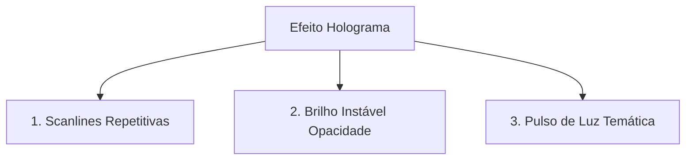

# 🎨 Estilos

> Sistema de design visual, animações e cursores personalizados da Pokédex.
> Arquivo: `index.css` — **178 linhas**

---

## Diretivas Base

O projeto utiliza o Tailwind CSS estruturado por meio de diretivas de importação padrão no topo do arquivo global de estilos:
```css
@tailwind base;
@tailwind components;
@tailwind utilities;
```

---

## 🖱️ Sistema de Cursores Customizados (Pokébola)

Para aprimorar a imersão temática de Pokédex eletrônica retrofuturista, o projeto implementa cursores personalizados vetorizados em SVG para diferentes tipos de interação do mouse:

### 1. Cursor Padrão (Seta Branca com Pokébola)
Substitui a seta clássica do sistema operacional por um design personalizado com uma pequena Pokébola vermelha e branca de alta definição na base:
- **Elemento**: `body, html` e todos os elementos de texto estáticos.
- **Formato**: URI codificada do SVG em Base64 no CSS.

### 2. Cursor de Link/Botão (Seta Vermelha Interativa)
Aplicado em elementos clicáveis (`a`, `button`, seletores, cards, etc.) para substituir a "mãozinha" (`pointer`) tradicional:
- **Elemento**: `a, button, [role="button"], select, input[type="submit"], input[type="button"], .cursor-pointer`
- **Design**: Seta vermelha em destaque vibrante acompanhada de uma animação suave.

### 3. Cursor de Texto (I-Beam com Mini Pokébola)
Aplicado ao pairar sobre áreas de texto editáveis:
- **Elemento**: `input[type="text"], input[type="number"], textarea`
- **Design**: Barra clássica em I-Beam cinza de edição acoplada a uma mini Pokébola minimalista no topo.

### 4. Cursor Desabilitado
Exibe uma Pokébola cinza translúcida com sinal de proibido (`not-allowed`) e opacidade reduzida a `0.6` para denotar indisponibilidade visual instantaneamente.

---

## 🌀 Efeitos de Holograma (Hologram FX)

Utilizado nos modais de exibição detalhada de Pokémon para simular uma projeção tridimensional de energia digital (Poké-Holograma):



### 1. Linhas de Varredura (`hologram-scanlines`)
Cria um pseudo-elemento `::after` absoluto que cobre o container com um gradiente linear repetitivo simulando as scanlines de monitores CRT antigos:
```css
background: repeating-linear-gradient(
  0deg,
  rgba(0, 0, 0, 0.15),
  rgba(0, 0, 0, 0.15) 1px,
  transparent 1px,
  transparent 2px
);
```

### 2. Oscilação de Luz (`hologram-flicker`)
Animação contínua de 8 segundos com oscilações bruscas e sutis de opacidade (variando entre `0.96`, `1.0`, e `0.98`) para dar vida e dinamismo de eletricidade estática ao holograma.

### 3. Pulso Glow Dinâmico (`hologram-glow-pulse`)
Animação de 3 segundos que pulsa a propriedade de sombra interna e externa (`box-shadow`) e bordas usando a cor tema selecionada dinamicamente via `color-mix()` CSS para misturar a cor principal com azul estelar transparente:
```css
box-shadow: 0 0 15px color-mix(in srgb, var(--theme-color) 40%, transparent);
```

---

## 📜 Scrollbars Personalizadas (`custom-scrollbar`)

Substitui a barra de rolagem cinza padrão do navegador por um design minimalista, fino e temático:

- **Largura**: Fixa em `8px` (`w-2`).
- **Trilho (Track)**: Transparente para não poluir o layout.
- **Alça (Thumb)**: Cantos perfeitamente redondos e cor configurada via variável CSS temática (`var(--scrollbar-color)`).
- **Hover**: Escurece levemente a alça com `var(--scrollbar-color-hover)` para feedback visual claro de arrasto.
- **Ocultador (`no-scrollbar`)**: Classe utilitária disponível para esconder totalmente as barras em navegadores Webkit (Chrome/Safari) e Firefox mantendo a rolagem intacta.

---

## 🏷️ Tags
#estilos #css #design #cursores #holograma #scrollbars #animacao
