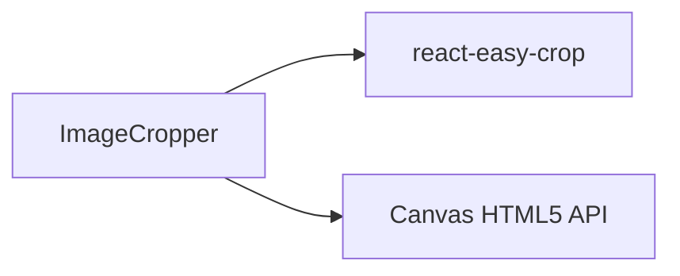

# ✂️ ImageCropper

> Modal interativo para recorte de imagens com proporção fixa de 1:1.
> Arquivo: `components/ImageCropper.tsx` — **90 linhas**
> Usado em: [[App#Aba Treinador]], [[PokemonCreationSheet]]

---

## Props

```typescript
interface ImageCropperProps {
  imageSrc: string;                                          // URL ou Base64 da imagem original
  onCropComplete: (croppedImageBase64: string) => void;     // Callback com a imagem final cortada
  onCancel: () => void;                                      // Callback ao cancelar
  themeColor?: string;                                       // Cor tema para bordas/botões (default: '#22d3ee')
}
```

---

## Estado

| Variável | Tipo | Inicial | Descrição |
|---|---|---|---|
| `crop` | `{ x: number, y: number }` | `{ x: 0, y: 0 }` | Posição de arrasto do corte |
| `zoom` | `number` | `1` | Nível de zoom da imagem |
| `croppedAreaPixels` | `any` | `null` | Coordenadas e dimensões em pixels do corte final |

---

## Métodos e Funções

### `getCroppedImg` (Helper estático)
Função assíncrona executada fora do escopo do componente para evitar re-renderizações desnecessárias. Utiliza a API do Canvas HTML5:

1. Instancia um elemento `new Image()` e carrega o `imageSrc`.
2. Cria um `canvas` com as dimensões exatas de pixel de corte (`pixelCrop.width` e `pixelCrop.height`).
3. Desenha a região correspondente no canvas com `drawImage` informando as coordenadas de origem `x, y` e as dimensões de destino.
4. Retorna a imagem final via `canvas.toDataURL('image/png')` no formato de uma string Base64 PNG.

```typescript
const getCroppedImg = async (imageSrc: string, pixelCrop: any): Promise<string>
```

### Handlers Internos

- `onCropCompleteHandler`: Atualiza as coordenadas em pixels sempre que o usuário arrasta ou dá zoom na imagem. Memoizado via `useCallback` para estabilidade.
- `handleConfirm`: Função assíncrona que invoca `getCroppedImg` e despacha o resultado via `onCropComplete(croppedImage)`.

---

## Interface e Componentes Externos

O componente consome o pacote **`react-easy-crop`** para a área de corte interativa:

- **Área de Recorte (`aspect={1}`)**: Força um recorte perfeitamente quadrado.
- **Estilos Inline customizados**:
  - `cropAreaStyle`: Borda tracejada na cor do tema (`border: 4px dashed ${themeColor}`) e sombra externa escura para isolar a área visível do corte (`box-shadow: 0 0 0 9999px rgba(0, 0, 0, 0.7)`).
  - Permite gestos de pinça, arrasto com o mouse/touch e roda do mouse para zoom.

---

## Layout Visual

O componente é renderizado em um container fixo de tela cheia (`fixed inset-0 z-[9999] bg-black/90`):

1. **Header Temático**: Título com ícone `fa-crop-simple` estilizado com a cor tema. Contém os botões "Cancelar" e "Confirmar" (na cor tema).
2. **Container do Recortador**: Ocupa o restante do espaço com fundo escuro e borda de destaque temática de 4px de espessura (`border-4 shadow-2xl`).

---

## Dependências



---

## 🏷️ Tags
#componente #crop #imagem #canvas #modal
