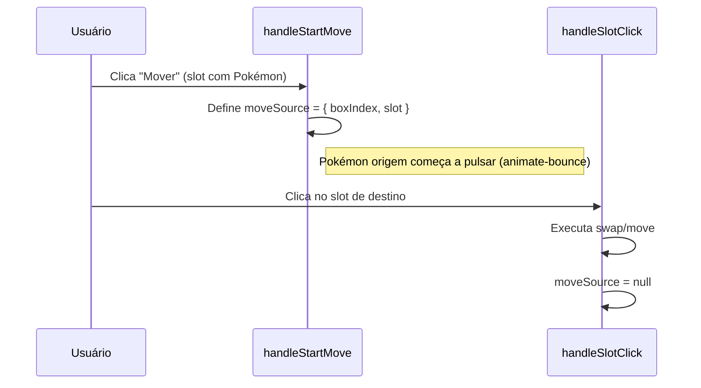
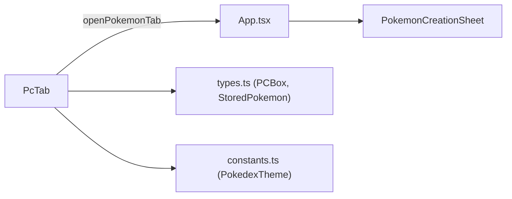

# 💻 PcTab

> Sistema de caixas PC para armazenamento de Pokémon (99 boxes × 30 slots).
> Arquivo: `components/PcTab.tsx` — **446 linhas**
> Usado por: [[App#Aba PC]]

---

## Props

```typescript
interface PcTabProps {
  boxes: PCBox[];                          // Array de 99 boxes
  onChange: (boxes: PCBox[]) => void;       // Callback para atualizar boxes
  theme: PokedexTheme;                     // Tema de cores
  characterId: string;                     // ID do personagem
  openPokemonTab: (params: {...}) => void;  // Abre aba dinâmica de Pokémon no App
}
```

---

## Estado

| Variável | Tipo | Default | Descrição |
|---|---|---|---|
| `currentBoxIndex` | `number` | `0` | Índice da box atual (0–98) |
| `selectedSlot` | `number \| null` | `null` | Slot selecionado (0–29) |
| `isCreating` | `boolean` | `false` | Modo de criação rápida ativo |
| `moveSource` | `{ boxIndex, slot } \| null` | `null` | Origem do Pokémon sendo movido |
| `formData` | `Partial<StoredPokemon>` | defaults | Dados do formulário de criação rápida |
| `typesInput` | `string` | `''` | Campo de texto para tipos (separados por vírgula) |

> [!NOTE]
> O antigo estado `viewMode` (`'box' | 'sheet'`) foi removido. A ficha de criação/edição agora é renderizada como uma aba dinâmica no [[App]] ao invés de um overlay local.

---

## Valores Derivados

| Nome | Cálculo | Descrição |
|---|---|---|
| `currentBox` | `boxes[currentBoxIndex]` | Box atual com fallback para box vazio |
| `getPokemonAt(slot)` | `currentBox.pokemons.find(p => p.slot === slot)` | Busca Pokémon por slot (memoizado) |
| `slots` | `Array.from({ length: 30 })` | 30 slots por box |

---

## Handlers

| Função | Descrição |
|---|---|
| `handleSlotClick(slot)` | Se em modo mover → executa troca/movimentação. Senão → seleciona o slot. |
| `handleCreate()` | Cria Pokémon rápido com dados do formulário no slot selecionado. |
| `handleDelete()` | Remove Pokémon do slot (com `confirm()`). "Tem certeza que deseja liberar este Pokémon?" |
| `handleStartMove()` | Inicia modo de movimentação: salva `moveSource` e limpa seleção. |

---

## Lógica de Movimentação

O sistema de **mover Pokémon entre slots** suporta:

1. **Mover para slot vazio** (mesma box ou box diferente)
2. **Trocar com outro Pokémon** (swap bidirecional)
3. **Cross-box move** (entre boxes diferentes)



---

## Layout

```
┌─────────────────────┬──────────────────────────────────┐
│ PAINEL ESQUERDO     │ PAINEL DIREITO (BOX GRID)        │
│ (1/3 da tela)       │                                  │
│                     │ ┌──────────────────────────────┐ │
│ ┌─────────────────┐ │ │  ← Box 1 / 99  Box Name →   │ │
│ │                 │ │ ├──────────────────────────────┤ │
│ │  Quando nenhum  │ │ │ ┌──┬──┬──┬──┬──┬──┐         │ │
│ │  slot é select: │ │ │ │01│02│03│04│05│06│  6×5     │ │
│ │                 │ │ │ ├──┼──┼──┼──┼──┼──┤  Grid    │ │
│ │  🎮 "Selecione  │ │ │ │07│08│09│10│11│12│  30      │ │
│ │   um slot para  │ │ │ ├──┼──┼──┼──┼──┼──┤  slots   │ │
│ │   ver opções"   │ │ │ │13│14│15│16│17│18│         │ │
│ │                 │ │ │ ├──┼──┼──┼──┼──┼──┤         │ │
│ │  Quando slot    │ │ │ │19│20│21│22│23│24│         │ │
│ │  selecionado:   │ │ │ ├──┼──┼──┼──┼──┼──┤         │ │
│ │                 │ │ │ │25│26│27│28│29│30│         │ │
│ │  📋 Formulário  │ │ │ └──┴──┴──┴──┴──┴──┘         │ │
│ │  (Espécie,Nome, │ │ │                              │ │
│ │   Nível, Gênero │ │ ├──────────────────────────────┤ │
│ │   Tipos)        │ │ │ SISTEMA POKEMON // V.2.0     │ │
│ │                 │ │ └──────────────────────────────┘ │
│ │  [Criar Pokemon]│ │                                  │
│ │  [Mover]        │ │                                  │
│ │  [Excluir]      │ │                                  │
│ └─────────────────┘ │                                  │
└─────────────────────┴──────────────────────────────────┘
```

---

## Painel Esquerdo — Estados

### Estado: Nenhum Slot Selecionado
- Ícone de gamepad
- Texto "Selecione um slot para ver opções"

### Estado: Modo Mover Ativo
- Ícone animado (animate-pulse)
- Texto "Selecione o slot de destino"
- Botão "Cancelar"

### Estado: Slot Vazio Selecionado
- Exibe número do slot
- Texto "Slot Disponível"
- Botão **"Criar Pokemon"** → chama `openPokemonTab({ origin: 'pc', type: 'ephemeral', boxIndex, slot, label: 'Novo Pokémon' })`

### Estado: Slot com Pokémon Selecionado
- Exibe formulário read-only (Espécie, Nome, Nível, Gênero, Tipos)
- Botão **"Abrir Ficha"** (cor do tema) → chama `openPokemonTab` para abrir a ficha como aba dinâmica efêmera
- Botão **"Mover"** → inicia modo de movimentação
- Botão **"Excluir"** → remove com confirmação

---

## Grid de Slots

- **6 colunas × 5 linhas** = 30 slots
- Fundo com pattern de dots decorativos
- Slot selecionado: branco, `scale-110`, borda na cor do tema, glow
- Slot com Pokémon: exibe imagem ou ícone + nome da espécie
- **Tooltip** no hover mostra o nome do Pokémon
- Pokémon sendo movido: borda tracejada animada (`animate-spin-slow`)

---

## Header da Box

- **Setas ←→** para navegar entre boxes
- **Nome da box** editável inline
- Contador **X / 99**

---

## Integração com Abas Dinâmicas

O antigo overlay holográfico fullscreen foi substituído pelo sistema de abas dinâmicas do [[App]]. Quando o usuário clica em "Criar Pokemon" ou "Abrir Ficha", o `PcTab` invoca `openPokemonTab()` com `origin: 'pc'` e `type: 'ephemeral'`, delegando a renderização do [[PokemonCreationSheet]] para o componente pai. A aba fecha automaticamente ao navegar para outra.

---

## Dependências



---

## 🏷️ Tags
#componente #pc #armazenamento #pokemon #boxes #abas-dinamicas
