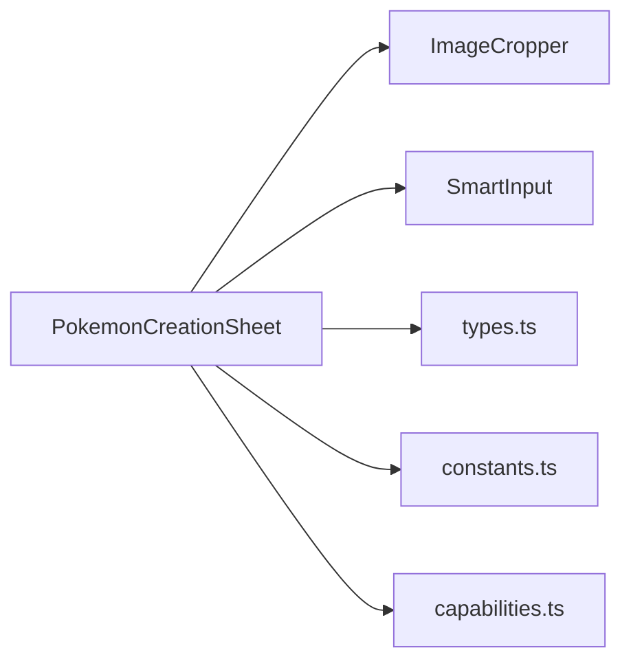

# 🐾 PokemonCreationSheet

> Formulário completo de criação e edição de Pokémon.
> Arquivo: `components/PokemonCreationSheet.tsx` — **538 linhas**
> Usado por: [[PcTab]], [[TeamTab]]

---

## Props

```typescript
interface PokemonCreationSheetProps {
  initialData?: Partial<StoredPokemon>;  // Dados pré-preenchidos (edição)
  theme: PokedexTheme;                   // Tema de cores
  onSave: (pokemon: StoredPokemon) => void;
  onCancel: () => void;
}
```

---

## Estado

| Variável | Tipo | Default | Descrição |
|---|---|---|---|
| `activeTab` | `'stats' \| 'capacidades' \| 'golpes' \| 'habilidades'` | `'stats'` | Sub-aba ativa |
| `imageInputRef` | `Ref<HTMLInputElement>` | — | Ref para input file oculto |
| `imageToCrop` | `string \| null` | `null` | Imagem base64 para recorte |
| `pokemon` | `Partial<StoredPokemon>` | Ver abaixo | Dados do Pokémon sendo editado |

### Valores Default do Pokémon
```typescript
{
  name: 'Nome', species: 'Espécie', level: 1, gender: 'U',
  types: ['NORMAL'], ball: 'Poke Ball', nature: '', natureFeatures: '',
  elementalDamageBonus: 0,
  capabilityTrait: { name: '', description: '' },
  hp: { current: 10, max: 10 },
  stats: { saude: 1, ataque: 1, ..., base: {...}, lvl: {...} },
  movements: { terrestre: 4, voo: 0, natacao: 2, subaquatico: 0, escavacao: 0 },
  evasions: { fisica: 1, especial: 1, veloz: 0 },
  capabilities: { force: {value:1}, intelligence: {value:2}, jump: {value:1}, other: [] },
  abilities: [{ name: '', description: '' }, { name: '', description: '' }],
  moves: [],
  ...initialData  // Merge com dados existentes
}
```

---

## Constantes Locais

### TYPE_COLORS
19 tipos Pokémon com cores hexadecimais:

| Tipo | Cor |
|---|---|
| NORMAL | `#919aa2` |
| LUTADOR | `#ce416b` |
| VOADOR | `#89aae3` |
| VENENOSO | `#b566ce` |
| TERRESTRE | `#d97845` |
| PEDRA | `#c5b78c` |
| INSETO | `#91c130` |
| FANTASMA | `#5269ad` |
| AÇO | `#5a8ea2` |
| FOGO | `#fe9d55` |
| ÁGUA | `#508fd6` |
| PLANTA | `#63BC5A` |
| ELÉTRICO | `#F4D23C` |
| PSÍQUICO | `#FA7179` |
| GELO | `#73CEC0` |
| DRAGÃO | `#0B6DC3` |
| SOMBRIO | `#5A5465` |
| FADA | `#EC8FE6` |
| CRISTAL | `#8E7CC3` |

### NATURE_DATA
35 naturezas com efeitos de stat:

| Natureza | +Stat | -Stat |
|---|---|---|
| Ousada | Saúde | Ataque |
| Dócil | Saúde | Defesa |
| Orgulhosa | Saúde | Atq Esp |
| Excêntrica | Saúde | Def Esp |
| Preguiçosa | Saúde | Velocidade |
| Desesperada | Ataque | Saúde |
| Solitária | Ataque | Defesa |
| Firme | Ataque | Atq Esp |
| Travessa | Ataque | Def Esp |
| Brava | Ataque | Velocidade |
| Rígida | Defesa | Saúde |
| Arrojada | Defesa | Ataque |
| Endiabrada | Defesa | Atq Esp |
| Negligente | Defesa | Def Esp |
| Relaxada | Defesa | Velocidade |
| Tímida | Atq Esp | Saúde |
| Modesta | Atq Esp | Ataque |
| Amável | Atq Esp | Defesa |
| Imprudente | Atq Esp | Def Esp |
| Quieta | Atq Esp | Velocidade |
| Enjoada | Def Esp | Saúde |
| Calma | Def Esp | Ataque |
| Gentil | Def Esp | Defesa |
| Meticulosa | Def Esp | Atq Esp |
| Atrevida | Def Esp | Velocidade |
| Séria | Velocidade | Saúde |
| Medrosa | Velocidade | Ataque |
| Apressada | Velocidade | Defesa |
| Alegre | Velocidade | Atq Esp |
| Ingênua | Velocidade | Def Esp |
| Comedida | — | — |
| Chata | — | — |
| Paciente | — | — |
| Sensata | — | — |
| Estoica | — | — |

---

## Handlers

| Função | Descrição |
|---|---|
| `handleImageUpload` | Lê arquivo de imagem como base64, define `imageToCrop` para abrir o [[ImageCropper]] |
| `handleStatChange(key, subKey, value)` | Atualiza `base` ou `lvl` de um stat, recalcula `total = base + lvl`. Se o stat é `saude`, recalcula `hp.max = (saude + level) × 3` |
| `updateMove(i, field, value)` | Atualiza campo de um golpe. Auto-preenche slots vazios até o índice `i` |

---

## Layout

```
┌───────────────────────────────────────────────────────┐
│ LEFT PANEL (35%)          │ RIGHT PANEL (65%)          │
│                           │                            │
│ ┌───────────────────────┐ │ ┌──────────────────────┐  │
│ │    📷 Foto Upload     │ │ │ Stats│Capac│Golpes│Hab│  │
│ └───────────────────────┘ │ ├──────────────────────┤  │
│                           │ │                      │  │
│ ┌──┬────────────────────┐ │ │   CONTEÚDO DA        │  │
│ │Lv│ Espécie / Nome     │ │ │   SUB-ABA ATIVA      │  │
│ └──┴────────────────────┘ │ │                      │  │
│                           │ │                      │  │
│ ┌───────────────────────┐ │ │                      │  │
│ │ HP ████████░░ 45/100  │ │ │                      │  │
│ └───────────────────────┘ │ │                      │  │
│                           │ │                      │  │
│ ┌──────────┬────────────┐ │ └──────────────────────┘  │
│ │ TIPO 1   │  TIPO 2    │ │                            │
│ └──────────┴────────────┘ │           ┌─────┐ ┌─────┐ │
│                           │           │Cancel│ │Salvar│ │
│ ┌───┬───┬───────────────┐ │           └─────┘ └─────┘ │
│ │ ♂ │ ♀ │  ⊙ Unknown    │ │      (Floating Footer)    │
│ └───┴───┴───────────────┘ │                            │
│                           │                            │
│ ┌───────────────────────┐ │                            │
│ │ Natureza: Ousada      │ │                            │
│ │ +Saúde / -Ataque      │ │                            │
│ └───────────────────────┘ │                            │
│                           │                            │
│ ┌───────────────────────┐ │                            │
│ │ Bônus Elemental: +2   │ │                            │
│ └───────────────────────┘ │                            │
└───────────────────────────────────────────────────────┘
```

---

## Sub-aba Stats

Tabela com 6 linhas (uma por [[Types#Stats|atributo]]):

| Coluna | Tipo | Descrição |
|---|---|---|
| Atributo | label | Nome do atributo (via `STAT_LABELS`) |
| Base | [[SmartInput]] | Valor base editável |
| Lvl | [[SmartInput]] | Bônus de nível editável |
| Fase | display | Fixo em `0` (placeholder futuro) |
| Total | display | `base + lvl` (calculado) |

---

## Sub-aba Capacidades

### Traço de Capacidades
- Input de texto para nome
- Textarea para descrição

### Capacidades Core
Via integração com [[Capabilities]]:

| Capacidade | Auto-Descrição |
|---|---|
| Força | Peso que consegue levantar (5kg a 1815kg) |
| Inteligência | Nível cognitivo (Vegetal a Gênio) |
| Salto | Distância de salto (1m a 30m) |

### Deslocamentos (5 colunas)
- Terrestre, Natação, Voo, Subaquático, Escavação

### Evasões (3 colunas)
- Física, Especial, Veloz

---

## Sub-aba Golpes

Grid **2×4** com 8 slots de golpe:

```
┌────────────────────┬────────────────────┐
│ Golpe 1            │ Golpe 2            │
│ ┌──────────┬─────┐ │ ┌──────────┬─────┐ │
│ │ NOME     │TIPO │ │ │ NOME     │TIPO │ │
│ ├──┬──┬──┬─┤     │ │ ├──┬──┬──┬─┤     │ │
│ │Ds│Pr│Fr│Al│     │ │ │Ds│Pr│Fr│Al│     │ │
│ ├──┴──┼──┴──┤     │ │ ├──┴──┼──┴──┤     │ │
│ │Dano │Categ│     │ │ │Dano │Categ│     │ │
│ ├─────┴─────┤     │ │ ├─────┴─────┤     │ │
│ │ Descrição │     │ │ │ Descrição │     │ │
│ └───────────┘     │ │ └───────────┘     │ │
│  ...              │ │  ...              │ │
└────────────────────┴────────────────────┘
```

O **header de cada card** é colorido pela cor do tipo selecionado (via `TYPE_COLORS`).

---

## Sub-aba Habilidades

2 cards de habilidade com:
- **Nome** — input no header colorido
- **Descrição** — textarea livre (min-height 140px)

---

## Dependências



---

## 🏷️ Tags
#componente #pokemon #formulário #criação #edição
