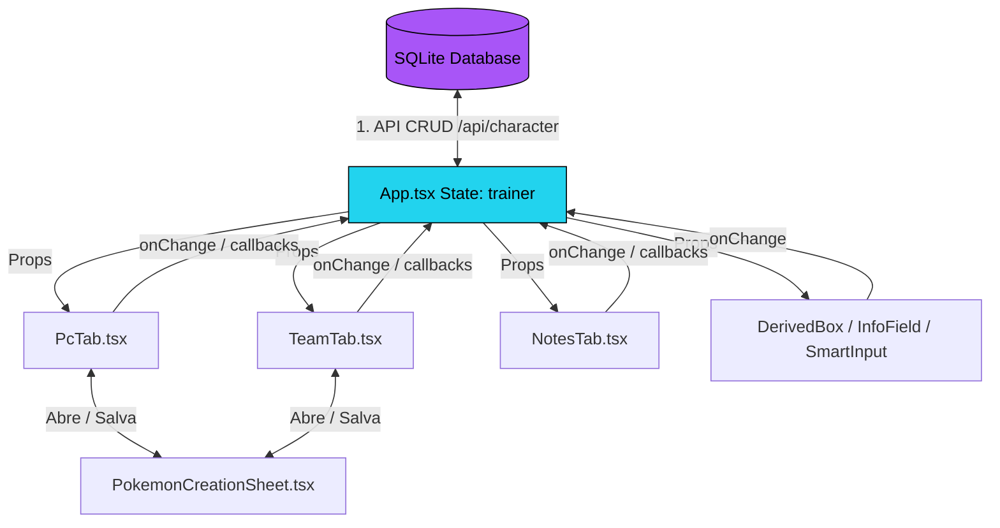

# 🔄 Sistema de Dados

> Documentação do fluxo de dados, ciclo de vida do estado, persistência relacional SQLite e comunicação assíncrona do [[Trainer Card Pro]].

---

## 🗺️ Visão Geral do Fluxo de Dados

A aplicação Trainer Card Pro utiliza o modelo de fluxo de dados unidirecional do React, centralizado no componente [[App]]. O estado do treinador e dos Pokémon é propagado de cima para baixo (via *props*) e modificado de baixo para cima (via *callback handlers*). A grande mudança estrutural da Fase 1 é que a fonte da verdade migrou do `localStorage` local do navegador para o **banco de dados SQLite relacional**, acessado através de rotas de API robustas no Next.js.

---

## 1. Ciclo de Vida da Inicialização (Carregamento do Banco de Dados)

Quando a aplicação é aberta, o [[App]] executa os seguintes passos sequenciais para construir o estado ativo:

### Passo A: Requisição GET de Inicialização
O componente `App` faz uma chamada `GET` à rota `/api/character?id=<id>` buscando os dados reais persistidos no banco SQLite.
- Se **não existir um personagem** criado no banco, o front-end envia um `POST` à rota `/api/character` para gerar uma nova ficha padrão, salvando-a no banco.
- Se **existir**: O backend retorna a ficha completa já hidratada (aninhando itens, pokémons da equipe, caixas do PC e anotações do diário).

### Passo B: Motor de Hidratação de Dados
O backend faz o parse automático das strings JSON do SQLite (`sheetData` para a ficha, `pokemonData` para dados específicos dos pokémons) antes de enviar a resposta estruturada ao cliente, eliminando a dependência de parsing e migrações instáveis no front-end.

---

## 2. Mutação de Estado e Sincronização (Auto-Save Persistente)

Todas as alterações na ficha são feitas de forma imutável atualizando o estado `trainer` do [[App]].

### Salvar Automático Real (`Auto-Save via API`)
Um efeito (`useEffect`) monitora alterações profundas no objeto de estado `trainer` e dispara chamadas assíncronas assépticas `PUT` para `/api/character` de forma transparente. Isso garante que cada mudança de ponto de status, edição de talento ou atualização de inventário seja sincronizada no banco de dados SQLite sem que o usuário precise clicar em nenhum botão.

> [!IMPORTANT]
> **Remoção de Ferramentas Locais de Import/Export/Reset**: 
> Como as informações agora residem de forma definitiva, segura e persistente no banco de dados SQLite, os botões manuais de **Importar Ficha**, **Exportar Ficha** e **Resetar Ficha** foram removidos do cabeçalho da Pokédex. A sincronização automática contínua substitui essas ferramentas de contingência locais antigas.

---

## 3. Fluxo de Dados: Equipe Principal <-> Armazenamento PC

A sincronização entre a equipe ativa ([[TeamTab]]) e as caixas de armazenamento do computador ([[PcTab]]) permanece centralizada e otimizada:

- Os Pokémon ativos no time são salvos na tabela `Pokemon` com a flag `isParty: true`.
- Os Pokémon armazenados no PC são salvos com `isParty: false` e um campo `boxName` associado ao index de 1 a 99 do PC.
- Ao atualizar o time ou trocar a posição de um Pokémon no PC, o front-end despacha uma requisição `PUT` para `/api/pokemon` com as flags de localização correspondentes, sincronizando a equipe e as boxes instantaneamente no banco de dados relacional.

---

## 4. Comunicação dos Componentes Auxiliares

### SmartInput (Fórmula -> Número)
O [[SmartInput]] funciona de forma isolada do estado global enquanto o usuário digita:
1. O usuário digita a expressão matemática (ex: `10 + 20`).
2. O estado interno local `localValue` armazena `"10 + 20"`.
3. No `onBlur` (ou `Enter`), a expressão é processada e convertida em `30`.
4. Dispara o callback `onChange(30)` que envia o valor final consolidado para o [[App]], atualizando o estado de forma limpa.

### ImageCropper (Upload -> Crop -> API Save)
1. O usuário seleciona um arquivo de imagem.
2. O front-end faz um upload multipart/form-data do arquivo físico recortador para `/api/upload`.
3. O servidor salva o arquivo de imagem em uma pasta local do sistema de arquivos pública e retorna uma URL persistente (`/uploads/...`).
4. A URL da imagem do avatar ou do Pokémon é atualizada no estado global e persistida no banco SQLite via `PUT` no endpoint da API.

---

## 🏷️ Tags
#dados #arquitetura #fluxodedados #sincronizacao #autosave #database #sqlite #prisma
