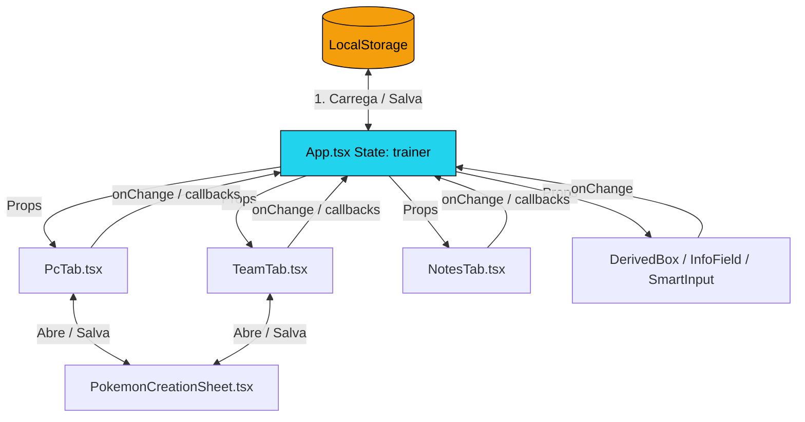
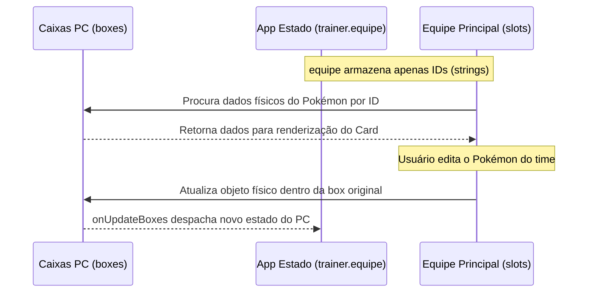

# 🔄 Sistema de Dados

> Documentação do fluxo de dados, ciclo de vida do estado, persistência e comunicação unidirecional/bidirecional do [[Trainer Card Pro]].

---

## 🗺️ Visão Geral do Fluxo de Dados

A aplicação Trainer Card Pro utiliza o modelo de fluxo de dados unidirecional do React, centralizado no componente [[App]]. O estado do treinador e dos Pokémon é propagado de cima para baixo (via *props*) e modificado de baixo para cima (via *callback handlers*).



---

## 1. Ciclo de Vida da Inicialização (Inicialização e Migração)

Quando a aplicação é aberta, o [[App]] executa os seguintes passos sequenciais para construir o estado ativo:

### Passo A: Leitura do LocalStorage
Tenta ler a chave `trainer_card_pro_data`. 
- Se **não existir**: Carrega as constantes padrão [[Constants#INITIAL_TRAINER_DATA]].
- Se **existir**: Realiza o parser do JSON.

### Passo B: Motor de Migração de Dados
Para evitar que atualizações de código quebrem fichas antigas de usuários salvos em seus navegadores, o [[App]] executa uma rotina de migração em tempo real:

1. **Migração de Perícias (Skills)**: Se o registro não possuir a chave `skills` (comum em versões antigas), inicializa a lista padrão [[Constants#DEFAULT_SKILLS]].
2. **Migração de Caixas PC (Boxes)**: Se o usuário possuir menos de 99 caixas PC salvas no vetor, preenche o restante com novos objetos `PCBox` vazios até totalizar 99 boxes.
3. **Migração de Equipe**: Se o vetor `equipe` armazenar objetos de Pokémon diretamente (legado), extrai seus IDs e os converte em um vetor de strings contendo estritamente IDs referenciados, movendo os Pokémon físicos para o PC.
4. **Migração de Talentos**: Se os talentos estiverem salvos no formato antigo de vetor de texto (`string[]`), converte-os para o novo formato estruturado de objetos:
   ```typescript
   // De:
   talentos: ["Acrobacia", "Mestre de Campo"]
   // Para:
   talentos: [
     { name: "Acrobacia", description: "Sem descrição." },
     { name: "Mestre de Campo", description: "Sem descrição." }
   ]
   ```

---

## 2. Mutação de Estado e Sincronização (Auto-Save)

Todas as alterações na ficha são feitas de forma imutável atualizando o estado `trainer` do [[App]].

### Salvar Automático (`Auto-Save`)
Um efeito (`useEffect`) monitora alterações profundas no objeto `trainer`. Sempre que o estado muda, ele serializa os dados e grava no navegador:
```typescript
useEffect(() => {
  localStorage.setItem('trainer_card_pro_data', JSON.stringify(trainer));
}, [trainer]);
```

---

## 3. Fluxo de Dados Bidirecional: Equipe Principal <-> Armazenamento PC

Uma das maiores complexidades da aplicação é o acoplamento dinâmico entre a equipe ativa ([[TeamTab]]) e as caixas de armazenamento do computador ([[PcTab]]):



### Regras de Ouro da Equipe:
1. O vetor `equipe` da interface [[Types#TrainerData|TrainerData]] armazena **apenas as strings de IDs** dos Pokémon (`string[]`).
2. Os dados reais e atributos físicos de todos os Pokémon (tanto ativos no time quanto armazenados nas caixas) residem **sempre** dentro do vetor `pokemons` de algum `PCBox` em `pcBoxes`.
3. Quando a aba [[TeamTab]] é renderizada, ela faz um mapeamento plano (`flatMap`) de todos os Pokémon de todos os boxes e filtra aqueles cujos IDs constam no vetor `equipe`.
4. Se o usuário edita um Pokémon diretamente da aba Equipe, o callback localiza o box de origem correspondente do Pokémon e altera o objeto físico lá no PC, disparando a atualização do estado global do [[App]].

---

## 4. Comunicação dos Componentes Auxiliares

### SmartInput (Fórmula -> Número)
O [[SmartInput]] funciona de forma isolada do estado global enquanto o usuário digita:
1. O usuário digita a expressão (ex: `10 + 20`).
2. O estado interno local `localValue` armazena `"10 + 20"`.
3. No `onBlur` (ou `Enter`), a expressão é processada e convertida em `30`.
4. Dispara a callback `onChange(30)` que envia o valor final consolidado para o [[App]], atualizando o estado pai de forma limpa.

### ImageCropper (Upload -> Crop -> Base64)
1. O usuário seleciona um arquivo de imagem.
2. O componente pai converte em uma string temporária blob/Base64.
3. O [[ImageCropper]] é aberto recebendo essa string.
4. O usuário edita a área do quadrado e confirma.
5. O recortador processa o Canvas, gera uma string final Base64 PNG e envia via `onCropComplete`.
6. O componente pai grava essa string Base64 diretamente no estado (`trainer.avatar` ou `pokemon.imageUrl`).

---

## 5. Exportação e Importação de Arquivos JSON

A manipulação de arquivos físicos locais para cópias de segurança de fichas segue regras estritas de compatibilidade:

### Exportação
Prioriza a moderna `File System Access API` (Chrome/Edge 86+), que abre um diálogo nativo do sistema operacional ("Salvar Como") e escreve o arquivo de texto formatado em JSON.
- *Fallback*: Se não suportado, gera programaticamente um link âncora `<a>` invisível com um objeto `Blob` codificado em Base64 e simula o clique para iniciar o download clássico pelo navegador.

### Importação
Lê o arquivo selecionado e realiza uma **Validação de Conformidade**:
1. Faz parser do texto para JSON.
2. Compara as chaves essenciais com [[Constants#INITIAL_TRAINER_DATA]] para garantir que é um arquivo válido de ficha.
3. Executa o motor de migração para atualizar dados de fichas de versões anteriores.
4. Sobrescreve o estado ativo de [[App]].

---

## 🏷️ Tags
#dados #arquitetura #fluxodedados #sincronizacao #autosave #migracao #ptu
