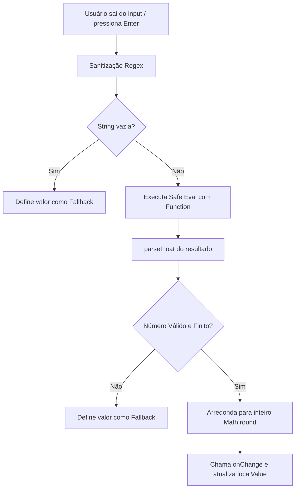

# 🧮 SmartInput

> Input de texto avançado com suporte a avaliação de expressões matemáticas integradas (calculadora inline).
> Arquivo: `components/SmartInput.tsx` — **81 linhas**
> Usado em: [[App#Aba Combate]], [[PokemonCreationSheet]]

---

## Props

O componente herda todas as propriedades nativas de um input HTML, omitindo `value` e `onChange` originais para substituí-los por tipos tipados estritos numéricos:

```typescript
interface SmartInputProps extends Omit<React.InputHTMLAttributes<HTMLInputElement>, 'value' | 'onChange'> {
  value: number | undefined;              // Valor numérico nativo
  onChange: (value: number) => void;      // Callback despachada após avaliação matemática
  fallback?: number;                      // Valor padrão se a expressão for inválida (default: 0)
}
```

---

## Estado

| Variável | Tipo | Inicial | Descrição |
|---|---|---|---|
| `localValue` | `string` | `value.toString()` | Texto digitado atualmente pelo usuário |
| `isFocused` | `boolean` | `false` | Indica se o campo está focado pelo usuário |

---

## Lógica de Sincronização

Para evitar re-renderizações e conflitos enquanto o usuário digita uma expressão (como `12 + 5`), o estado interno `localValue` sincroniza com o valor da prop `value` **apenas** quando o input não está em foco:

```typescript
useEffect(() => {
  if (!isFocused) {
    setLocalValue(value?.toString() || '');
  }
}, [value, isFocused]);
```

---

## Motor de Avaliação Matemática (`evaluateAndSubmit`)

Executado ao perder o foco (`onBlur`) ou ao pressionar `Enter`. O fluxo de processamento garante segurança contra injeção de scripts maliciosos:



### 1. Sanitização de Expressão (Regex de Segurança)
Filtra a string retendo apenas dígitos, pontos decimais e operadores matemáticos básicos:
```typescript
const sanitized = localValue.replace(/[^0-9+\-*/().]/g, '');
```

### 2. Avaliação Segura (Safe Sandbox)
Usa o construtor `Function` ao invés de `eval` nativo, limitando o escopo de execução:
```typescript
const result = new Function('return ' + sanitized)();
const num = parseFloat(result);
```

### 3. Arredondamento
Valores resultantes são convertidos para decimais e arredondados para inteiros matemáticos de forma limpa:
```typescript
const final = Math.round(num);
```

---

## Handlers Internos

- `handleBlur`: Define `isFocused` como falso, executa `evaluateAndSubmit()` e despacha evento `onBlur` original do usuário se presente.
- `handleFocus`: Define `isFocused` como verdadeiro e propaga o evento `onFocus` original.
- `handleKeyDown`: Se pressionado `Enter`, invoca programaticamente `.blur()` no elemento para disparar a validação matemática.

---

## Exemplos de Uso Prático

| Entrada Digitada | Resultado no Blur | Explicação |
|---|---|---|
| `10+5` | `15` | Soma simples |
| `6*4/2` | `12` | Ordem de precedência simples |
| `10+(2*3)` | `16` | Parênteses avaliados primeiro |
| `abc-10` | `10` | Remove caracteres 'abc' e executa `10` |
| `invalid` | `0` (ou fallback) | Fallback por erro de avaliação |

---

## 🏷️ Tags
#componente #calculadora #input #matematica #expressao #seguranca
