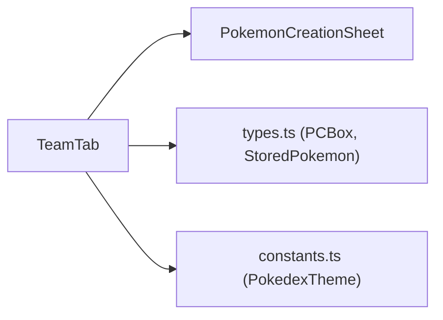

# 👥 TeamTab

> Gerenciamento da equipe ativa de Pokémon (máximo 6 membros).
> Arquivo: `components/TeamTab.tsx` — **185 linhas**
> Usado por: [[App#Aba Equipe]]

---

## Props

```typescript
interface TeamTabProps {
  equipeIds: string[];                              // IDs dos Pokémon na equipe
  pcBoxes: PCBox[];                                 // Todas as boxes do PC
  theme: PokedexTheme;                              // Tema de cores
  onChange: (newEquipeIds: string[]) => void;        // Atualiza a equipe
  onUpdateBoxes: (newBoxes: PCBox[]) => void;       // Atualiza os boxes
}
```

---

## Estado

| Variável | Tipo | Descrição |
|---|---|---|
| `isSelectingForSlot` | `number \| null` | Índice do slot sendo preenchido (abre modal de seleção) |
| `editingPokemon` | `StoredPokemon \| null` | Pokémon sendo editado (abre [[PokemonCreationSheet]]) |

---

## Valores Derivados

| Nome | Cálculo | Descrição |
|---|---|---|
| `allPokemons` | `pcBoxes.flatMap(b => b.pokemons)` | Lista plana de todos os Pokémon do PC, com `boxId` |
| `slots` | `Array.from({ length: 6 })` | 6 slots visuais fixos |

---

## Handlers

| Função | Descrição |
|---|---|
| `handleSelectPokemon(id)` | Adiciona o Pokémon ao slot em edição. Filtra entradas vazias com `.filter(Boolean)`. |
| `handleRemoveMember(e, index)` | Remove membro da equipe por índice. Usa `stopPropagation` para não abrir edição. |
| `handleSavePokemon(updatedPkmn)` | Atualiza o Pokémon editado em seu box original. Busca por ID em todos os boxes. |

---

## Layout

### Grid de 6 Slots

```
┌────────────┬────────────┬────────────┐
│ 🐾 Pkmn 1  │ 🐾 Pkmn 2  │ 🐾 Pkmn 3  │
│ [Foto]     │ [Foto]     │ [Foto]     │
│ Sprigatito │ Zigzagoon  │ + Adicionar│
│ Lvl 5      │ Lvl 3      │   Membro   │
├────────────┼────────────┼────────────┤
│ + Adicionar│ + Adicionar│ + Adicionar│
│   Membro   │   Membro   │   Membro   │
└────────────┴────────────┴────────────┘
```

### Card de Pokémon ativo
- **Foto circular** com borda na cor do tema (128×128px)
- **Espécie + Nível** em texto pequeno
- **Nome** em destaque (cor do tema)
- **Tipos** como badges
- **Botão ✕** para remover da equipe (canto superior direito)
- **Click no card** → abre [[PokemonCreationSheet]] para edição
- Animação de hover: `scale-105`, `shadow-2xl`, `z-50`

### Slot Vazio
- Borda tracejada, ícone **+**
- Hover: borda preta, escala 102%
- Click → abre modal de seleção do PC

---

## Modal de Seleção do PC

Ativado quando `isSelectingForSlot !== null`:

- **Overlay** escuro com backdrop-blur
- **Header** estilo Pokédex com título "Selecionar do PC"
- **Grid** 2-4 colunas com todos os Pokémon do PC
- Pokémon **já na equipe** aparecem em grayscale com badge "Na Equipe" (não-clicáveis)
- Pokémon disponíveis → click adiciona ao slot
- **Estado vazio**: "O PC está vazio — Crie pokémons na aba PC primeiro."

---

## Modal de Edição

Ativado quando `editingPokemon !== null`:

- **Overlay fullscreen** com gradiente radial (cor do tema)
- **Feixe de luz** decorativo (conic-gradient com blur)
- Container com efeito **hologram** (scanlines + glow)
- Renderiza [[PokemonCreationSheet]] com `initialData={editingPokemon}`
- Scale: `1.13` (13% maior que o normal)

---

## Dependências



---

## 🏷️ Tags
#componente #equipe #pokemon #time
