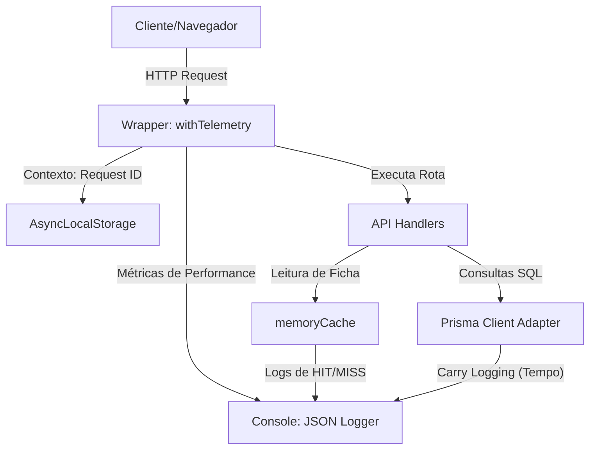

# 📊 Telemetria, Observabilidade e Resiliência (DevOps)

> Especificação do sistema de logs estruturados, Request ID, análise de performance e automação de deploys com rollback para a Pokédex.

---

## 🏗️ Visão Geral da Arquitetura de Observabilidade

Para suportar auditorias, monitoramento em produção e depuração ágil de erros, o sistema implementa um fluxo de telemetria unificado que intercepta a camada de rede (APIs), o banco de dados (Prisma) e a memória da aplicação.



---

## 📐 Padrões de Monitoramento Implementados

### 1. Request ID Único (`X-Request-ID`)
Cada requisição às rotas de API gera um identificador único universal (UUID) gerado por `crypto.randomUUID()`. 
- **Cabeçalho de Resposta**: Retornado no header `X-Request-ID`.
- **Contexto Assíncrono**: Gerenciado por meio do `AsyncLocalStorage` do Node.js, garantindo que qualquer chamada interna de log do banco ou de cache saiba exatamente a qual requisição HTTP ela pertence sem a necessidade de passar parâmetros extras.

### 2. Logs Estruturados em JSON
Todas as saídas de logs foram portadas para JSON estruturado, facilitando a ingestão por coletores de logs modernos (como Datadog, ELK Stack, AWS CloudWatch). O formato do objeto inclui:
```json
{
  "timestamp": "2026-06-04T04:25:35.123Z",
  "level": "INFO",
  "requestId": "fca16c58-4cff-45a1-ad28-25b6f09cf1dd",
  "message": "DB Query Executed",
  "component": "Database",
  "query": "SELECT * FROM Character WHERE id = ?",
  "durationMs": 4.2
}
```

### 3. Stack Traces Completos
Exceções capturadas de forma síncrona ou assíncrona nas rotas de API são formatadas contendo o `message` e o `stack` trace original em texto limpo dentro do JSON de nível `ERROR`.

### 4. Health Check Detalhado (`/api/health`)
Endpoint de verificação de integridade operacional em produção que expõe:
- **Database Connectivity**: Status (`healthy`/`unhealthy`) e tempo de resposta de query teste (`SELECT 1`).
- **Metrics**: Tempo de atividade em segundos (`uptimeSeconds`), uso de memória detalhado (`heapTotal`, `heapUsed`, `rss`, `external`) e tempos acumulados de processamento de CPU (`user`, `system`).

### 5. Medição de Performance no Banco (Prisma Carry Logging)
O `PrismaClient` em [prisma.ts](file:///C:/Users/Julio/OneDrive/Documentos/Trainer-Card-Pro/trainer-card-pro/lib/prisma.ts) foi instrumentado com emissão de eventos de queries em tempo real. Cada operação executada no SQLite tem seu tempo gasto calculado em milissegundos e logado com a chave `durationMs`.

### 6. Rastreamento de Hits/Misses em Cache
A leitura das fichas de personagens (`GET /api/character`) emprega a camada de cache rápida [cache.ts](file:///C:/Users/Julio/OneDrive/Documentos/Trainer-Card-Pro/trainer-card-pro/lib/cache.ts) em memória. Todas as operações de leitura resultam em logs estruturados de `Cache HIT` ou `Cache MISS`, acompanhados de invalidação automática nas mutações (`PUT /api/character`).

### 7. Alertas de Anomalias (Threshold Check)
No fim de cada requisição processada pelo wrapper `withTelemetry`, a aplicação valida dois limites de segurança:
- **Latência Crítica**: Alerta de severidade `WARN` caso o tempo de processamento exceda **500ms**.
- **Vazamento de Memória**: Alerta de severidade `WARN` caso o Heap de memória utilizado ultrapasse **150MB**.

---

## 🧪 Scripts de Automação DevOps

### Testes de Regressão Críticos (`scripts/regression-test.js`)
Testa programaticamente a Pokédex local para certificar que as regras de observabilidade estão em conformidade:
- Valida o endpoint de saúde `/api/health`.
- Valida o fluxo de POST e GET de personagem.
- Verifica o funcionamento correto do cache (GET 1 = Miss, GET 2 = Hit com tempo de resposta expressivamente menor).
- Confirma a presença dos Request IDs injetados nos cabeçalhos HTTP.

### Deploy Monitorado e Rollback Automático (`scripts/deploy-rollback.js`)
Simula um fluxo de CI/CD que implanta a Pokédex em produção e executa um monitoramento de fumaça inicial (smoke test):
- Consome o endpoint `/api/health`.
- Caso o servidor ou o banco de dados estejam respondendo com falhas, o pipeline dispara um rollback imediato para proteger a estabilidade da produção, restaurando o release e banco estável anterior.

---

## 🏷️ Tags
#devops #observabilidade #logs #json #healthcheck #telemetria #prisma #cache #rollback #deploy #alertas
