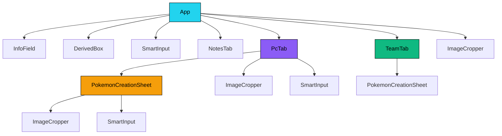

# 🎮 Trainer Card Pro

|> Aplicação Web de ficha digital para o RPG de mesa Pokémon: Tabletop United (PTU) — Biblioteca Élfica.
|> Construída com [[Stack Tecnológica|Next.js + React + TailwindCSS + TypeScript]].

---

## 📋 Visão Geral

O **Trainer Card Pro** é uma ficha de personagem interativa e temática, projetada para sessões de RPG Pokémon. A aplicação permite ao jogador gerenciar **todos os aspectos** de seu treinador e de seus Pokémon capturados de forma visual e intuitiva.

A interface simula uma **Pokédex digital**, com temas de cores intercambiáveis e um visual robusto inspirado em dispositivos eletrônicos do universo Pokémon.

---

## 🗂️ Estrutura de Navegação

A aplicação é organizada em **6 abas principais** acessíveis pelo componente [[App]]:

| Aba | Componente | Descrição |
|---|---|---|
| 🧑 Treinador | [[App#Aba Treinador]] | Perfil, dados biográficos, classes, talentos, movimentos |
| ⚔️ Combate | [[App#Aba Combate]] | Atributos, HP, evasões, movimentos, perícias |
| 👥 Equipe | [[TeamTab]] | Pokémon ativos na equipe (máx. 6) |
| 🎒 Mochila | [[App#Aba Mochila]] | Inventário de itens |
| 💻 PC | [[PcTab]] | Sistema de caixas PC (99 boxes) |
| 📝 Notas | [[NotesTab]] | Anotações livres do jogador |

---

## 🧩 Mapa de Componentes



---

## 📁 Arquitetura de Arquivos

```
trainer-card-pro/
├── App.tsx                    → [[App|Componente raiz da Pokédex]]
├── types.ts                   → [[Types|Definições de tipos]]
├── constants.ts               → [[Constants|Constantes e dados iniciais]]
├── index.css                  → [[Estilos|CSS global + scrollbar custom]]
├── next.config.ts             → Configuração do Next.js 15
├── tailwind.config.ts         → Configuração do Tailwind CSS
├── app/
│   ├── layout.tsx             → Layout raiz do Next.js
│   ├── page.tsx               → Página raiz (renderiza o App)
│   ├── error.tsx              → Error Boundary global (React)
│   └── api/                   → Rotas do servidor (character, pokemon, item, note, trade, upload, health)
├── components/
│   ├── DerivedBox.tsx         → [[DerivedBox]]
│   ├── ImageCropper.tsx       → [[ImageCropper]]
│   ├── InfoField.tsx          → [[InfoField]]
│   ├── NotesTab.tsx           → [[NotesTab]]
│   ├── PcTab.tsx              → [[PcTab]]
│   ├── PokemonCreationSheet.tsx → [[PokemonCreationSheet]]
│   ├── SmartInput.tsx         → [[SmartInput]]
│   ├── TeamTab.tsx            → [[TeamTab]]
│   └── TradeModal.tsx         → Modal do sistema de trocas
├── lib/
│   ├── prisma.ts              → Inicialização do Prisma Client com SQLite
│   ├── telemetry.ts           → Sistema de logs estruturados e telemetria
│   ├── cache.ts               → Camada de cache em memória
│   └── safeFetch.ts           → Helper de requisições HTTP seguras
└── src/
    └── data/
        └── capabilities.ts    → [[Capabilities|Dados de capacidades]]
```

---

## 🔗 Links Rápidos

- [[Features]] — Lista completa de funcionalidades
- [[Sistema de Dados]] — Como os dados fluem na aplicação
- [[Types]] — Todas as interfaces TypeScript
- [[Constants]] — Constantes, temas e dados iniciais
- [[Stack Tecnológica]] — Tecnologias utilizadas

---

## 🏷️ Tags
#projeto #pokemon #rpg #ficha #react #typescript
