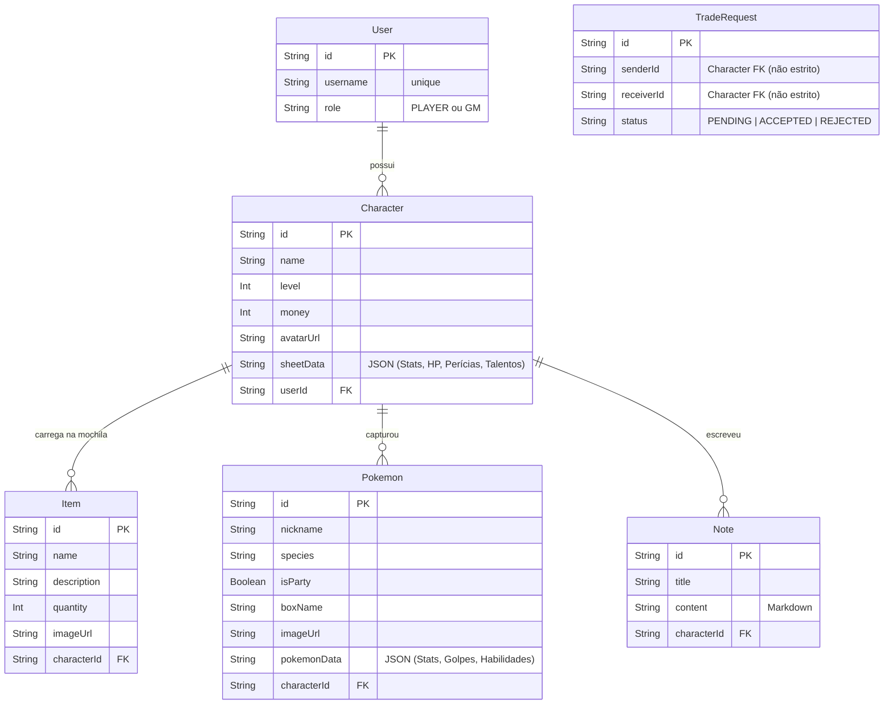

# 🗄️ Arquitetura de Banco de Dados

> Especificação da estrutura de dados relacionais e modelo de persistência do [[Trainer Card Pro]], implementada com SQLite, Prisma ORM 7 e `better-sqlite3` (Fase 1).

---

## 🏗️ Princípios de Design

1. **Separação Jogador vs Personagem (A Regra de Ouro)**:
   - Um **Usuário** (`User`) representa a conta física do jogador ou mestre (GM).
   - Um **Personagem** (`Character`) representa a entidade in-game (Ficha). Um único usuário pode ter vários personagens (ex: jogar em duas mesas diferentes).
2. **Dados Flexíveis (JSON)**:
   - Para evitar tabelas gigantes com centenas de colunas esparsas para cada atributo, perícia, talento e HP da ficha, foi adotada a estratégia de "Campos Flexíveis" em JSON (como `sheetData` e `pokemonData`). O Prisma armazena isso como String no SQLite, e o Backend converte para JSON nas requisições da API de forma segura.
3. **Driver Adapter de Alta Performance (Prisma 7)**:
   - Devido às novas diretrizes do Prisma 7 de remoção dos motores nativos Rust em favor de WASM e adapters leves, o banco SQLite é acessado através do pacote `better-sqlite3` combinado com o `@prisma/adapter-better-sqlite3`. Isso garante excelente performance no desenvolvimento local no Windows.

---

## 📊 Diagrama de Esquema (Entidade-Relacionamento)



---

## 🗃️ Inicialização do PrismaClient (`lib/prisma.ts`)

Para se adequar à nova arquitetura do Prisma 7, o cliente Prisma é inicializado utilizando o adapter do `better-sqlite3` para conexões locais:

```typescript
import { PrismaClient } from '@prisma/client';
import { PrismaBetterSqlite3 } from '@prisma/adapter-better-sqlite3';
import Database from 'better-sqlite3';

const globalForPrisma = global as unknown as { prisma: PrismaClient };

export const prisma =
  globalForPrisma.prisma ||
  (() => {
    // Abre a conexão SQLite usando o driver síncrono ultra-rápido better-sqlite3
    const db = new Database('prisma/dev.db');
    // Cria o driver adapter exigido pelo Prisma 7
    const adapter = new PrismaBetterSqlite3(db);
    // Inicializa o cliente Prisma usando o adapter
    return new PrismaClient({ adapter });
  })();

if (process.env.NODE_ENV !== 'production') globalForPrisma.prisma = prisma;
```

---

## 🗃️ Modelos Base

### User
Representa a conta autenticada.
- **id** (`String` / UUID)
- **username** (`String`, Único)
- **role** (`String`): Padrão "PLAYER", aceita "GM".

### Character
A ficha interativa em si.
- **id** (`String` / UUID)
- **name** (`String`)
- **level** (`Int`): Padrão `1`.
- **money** (`Int`): Padrão `0`.
- **avatarUrl** (`String?`): Caminho local para o avatar após o upload da crop.
- **sheetData** (`String` JSON): Guarda a árvore complexa da ficha: Atributos Atuais/Caps, AP, HP máximo e atual, lista de Talentos, classes, background, e conceitos estruturais não tabulados individualmente.
- **userId** (`String`): Referência obrigatória ao dono.

### Item
O inventário estruturado do personagem.
- **id** (`String` / UUID)
- **name** (`String`)
- **description** (`String?`)
- **quantity** (`Int`): Controla o contador, permitindo manipulação (`+`/`-`).
- **imageUrl** (`String?`)
- **characterId** (`String`): Referência obrigatória ao dono.

### Pokemon
Guarda tanto a equipe ativa (`Party`) quanto as caixas do PC (`PC Box`).
- **id** (`String` / UUID)
- **nickname** (`String`)
- **species** (`String`): Nome da espécie base.
- **isParty** (`Boolean`): Flag rápida. Se `true`, ele é exibido na aba Equipe.
- **boxName** (`String?`): Se `isParty = false`, este campo indica em qual pasta/caixa do PC ele se encontra.
- **imageUrl** (`String?`)
- **pokemonData** (`String` JSON): Guarda estatísticas de combate (ataque, defesa), evasões base, lista de movimentos (ataques) do Pokémon com dano e frequências, tipos, fraquezas.
- **characterId** (`String`): O treinador que possui o Pokémon.

### Note
As páginas do diário/caderno de anotações.
- **title** (`String`): Título da aba.
- **content** (`String`): O corpo do texto em puro Markdown, suportando GitHub Flavored Markdown (GFM).

### TradeRequest
Controla negociações p2p (trocas de itens ou pokémons entre dois Personagens).
- **senderId** (`String`): O ID do Character que propôs a troca.
- **receiverId** (`String`): O ID do Character destino.
- **status** (`String`): Enum simplificado (`PENDING`, `ACCEPTED`, `REJECTED`).

---

## 🏷️ Tags
#dados #arquitetura #prisma #sqlite #better-sqlite3 #db #modelagem #relacionamento
