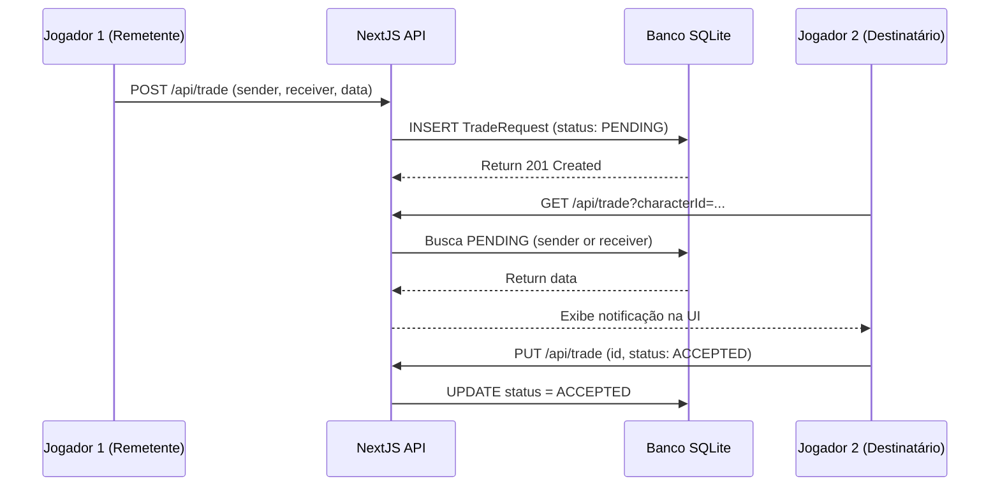

# 🔄 Sistema de Trocas (Link Cable)

> Sistema assíncrono para comunicação e trocas entre personagens/jogadores da campanha.
> Endpoints: `app/api/trade/route.ts`
> Client UI: `components/TradeModal.tsx`

---

## Visão Geral

Na Etapa 5 do Roadmap, implementamos o **TradeRequest**, um mecanismo para permitir que treinadores solicitem e realizem trocas, enviando uma requisição de ping ("sinal detectado") e acompanhando sua aprovação/rejeição. O objetivo foi validar o ciclo de vida do modelo `TradeRequest`.

## Banco de Dados

O modelo de dados está em `prisma/schema.prisma` e permite escalabilidade futura para listar Itens e Pokémons em detalhes:

```prisma
model TradeRequest {
  id         String @id @default(uuid())
  senderId   String // Character ID de quem enviou a proposta
  receiverId String // Character ID do destinatário
  status     String @default("PENDING") // Status da troca ("PENDING", "ACCEPTED", "REJECTED")
  tradeData  String @default("{}") // Payload flexível (JSON) com ids de pokemons/items negociados
}
```

---

## Rotas de API (`/api/trade`)

### `GET /api/trade?characterId={id}`
Busca as trocas onde o personagem é **remetente** ou **destinatário** com status `PENDING`.
A rota mapeia e enriquece os resultados buscando rapidamente no DB os nomes dos personagens associados para exibição na UI, sem exigir `include` profundo, já que a volumetria é pequena.

### `POST /api/trade`
Cria uma nova requisição `PENDING`.
**Payload:**
```json
{
  "senderId": "char-123",
  "receiverId": "rival-456",
  "tradeData": { "items": [], "pokemons": [] }
}
```

### `PUT /api/trade`
Responde à solicitação.
**Payload:**
```json
{
  "id": "trade-id-xyz",
  "status": "ACCEPTED" // ou "REJECTED"
}
```

> **Nota Técnica**: Na implementação inicial (Fase 1), a atualização para `ACCEPTED` muda o status no DB. A lógica física de alterar a coluna `characterId` do registro do Item ou Pokemon seria feita na expansão desse escopo, onde transferiríamos os registros do Prisma baseados nas entradas contidas em `tradeData`.

---

## Interface (Client)

O componente `TradeModal.tsx` renderiza um painel flutuante, escurecendo a tela principal (`backdrop-blur-sm`). É ativado pelo novo botão de **Link Cable** presente no header superior do `App.tsx`.

Ele divide a UI em 2 abas:
- **Caixa de Entrada (`pending`)**: Onde o treinador visualiza requisições que chegam e acompanha as que enviou.
- **Nova Proposta (`new`)**: Permite simular o envio de um ping (Trade Request vazio) selecionando outro jogador do mundo (em teste, utiliza mocks de characters se o banco estiver vazio de players alheios).

## Fluxo



---

## 🏷️ Tags
#backend #trocas #trade #prisma #modal #api
