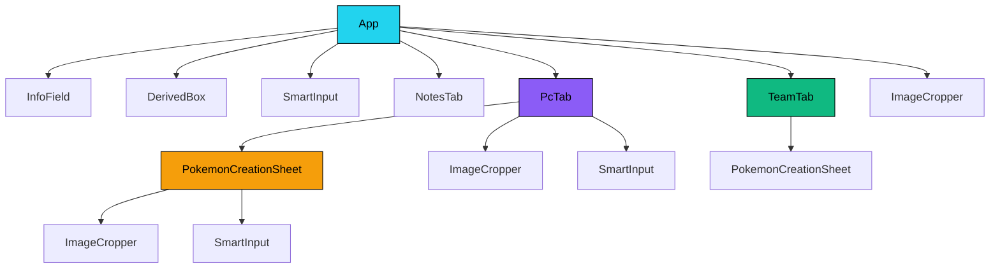

## Resumo

Documento conceitual e porta de entrada principal do projeto Trainer Card Pro - uma ficha digital interativa e avançada para o RPG Pokémon Tabletop United (PTU).


# 🎮 Trainer Card Pro

|> Aplicação Web de ficha digital para o RPG de mesa Pokémon: Tabletop United (PTU) — Biblioteca Élfica.
|> Construída com [[[Arquitetura] Stack Tecnologica|Next.js + React + TailwindCSS + TypeScript]].

---

## 📋 Visão Geral

O **Trainer Card Pro** é uma ficha de personagem interativa e temática, projetada para sessões de RPG Pokémon. A aplicação permite ao jogador gerenciar **todos os aspectos** de seu treinador e de seus Pokémon capturados de forma visual e intuitiva.

A interface simula uma **Pokédex digital**, com temas de cores intercambiáveis e um visual robusto inspirado em dispositivos eletrônicos do universo Pokémon.

---

## 🗂️ Estrutura de Navegação

A aplicação é organizada em **6 abas principais** acessíveis pelo componente [[[Componente] App]]:

| Aba | Componente | Descrição |
|---|---|---|
| 🧑 Treinador | [[[Componente] App#Aba Treinador]] | Perfil, dados biográficos, classes, talentos, movimentos |
| ⚔️ Combate | [[[Componente] App#Aba Combate]] | Atributos, HP, evasões, movimentos, perícias |
| 👥 Equipe | [[[Componente] TeamTab]] | Pokémon ativos na equipe (máx. 6) |
| 🎒 Mochila | [[[Componente] App#Aba Mochila]] | Inventário de itens |
| 💻 PC | [[[Componente] PcTab]] | Sistema de caixas PC (99 boxes) |
| 📝 Notas | [[[Componente] NotesTab]] | Anotações livres do jogador |

---

## 🧩 Mapa de Componentes



---

## 📁 Arquitetura de Arquivos

```
trainer-card-pro/
├── App.tsx                    → [[[Componente] App|Componente raiz da Pokédex]]
├── types.ts                   → [[[Dados] Tipagem TypeScript|Definições de tipos]]
├── constants.ts               → [[[Dados] Constantes|Constantes e dados iniciais]]
├── index.css                  → [[[Interface] Estilos e Temas|CSS global + scrollbar custom]]
├── next.config.ts             → Configuração do Next.js 15
├── tailwind.config.ts         → Configuração do Tailwind CSS
├── app/
│   ├── layout.tsx             → Layout raiz do Next.js
│   ├── page.tsx               → Página raiz (renderiza o App)
│   ├── error.tsx              → Error Boundary global (React)
│   └── api/                   → Rotas do servidor (character, pokemon, item, note, trade, upload, health)
├── components/
│   ├── DerivedBox.tsx         → [[[Componente] DerivedBox]]
│   ├── ImageCropper.tsx       → [[[Componente] ImageCropper]]
│   ├── InfoField.tsx          → [[[Componente] InfoField]]
│   ├── NotesTab.tsx           → [[[Componente] NotesTab]]
│   ├── PcTab.tsx              → [[[Componente] PcTab]]
│   ├── PokemonCreationSheet.tsx → [[[Componente] PokemonCreationSheet]]
│   ├── SmartInput.tsx         → [[[Componente] SmartInput]]
│   ├── TeamTab.tsx            → [[[Componente] TeamTab]]
│   └── TradeModal.tsx         → Modal do sistema de trocas
├── lib/
│   ├── prisma.ts              → Inicialização do Prisma Client com SQLite
│   ├── telemetry.ts           → Sistema de logs estruturados e telemetria
│   ├── cache.ts               → Camada de cache em memória
│   └── safeFetch.ts           → Helper de requisições HTTP seguras
└── src/
    └── data/
        └── capabilities.ts    → [[[Dados] Capacidades PTU|Dados de capacidades]]
```

---

## 🔗 Links Rápidos

- [[[Arquitetura] Features e Regras]] — Lista completa de funcionalidades
- [[[Arquitetura] Sistema de Dados]] — Como os dados fluem na aplicação
- [[[Dados] Tipagem TypeScript]] — Todas as interfaces TypeScript
- [[[Dados] Constantes]] — Constantes, temas e dados iniciais
- [[[Arquitetura] Stack Tecnologica]] — Tecnologias utilizadas

---

## 🏷️ Tags
#projeto #pokemon #rpg #ficha #react #typescript


---

## Conexões

- **Mapa Mestre:** [[_VaultMap]]
- **Arquitetura:** [[[Arquitetura] Features e Regras]], [[[Arquitetura] Stack Tecnologica]], [[[Arquitetura] Banco de Dados]]

---

## Estado Atual e Próximos Passos

- [x] Visão geral do produto e proposição de valor.
- [x] Interface Pokédex digital de alta performance em Next.js.
- [ ] Lançamento da versão 2.0 com suporte a batalhas automatizadas de dados.